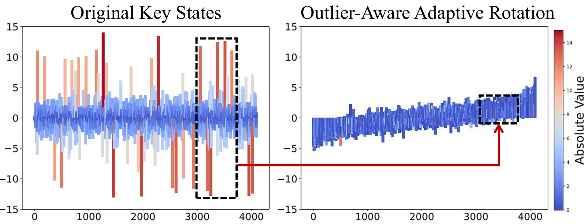
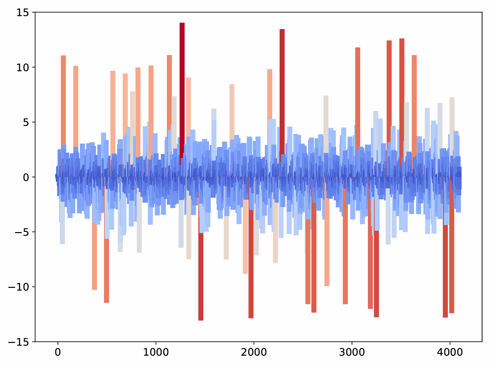
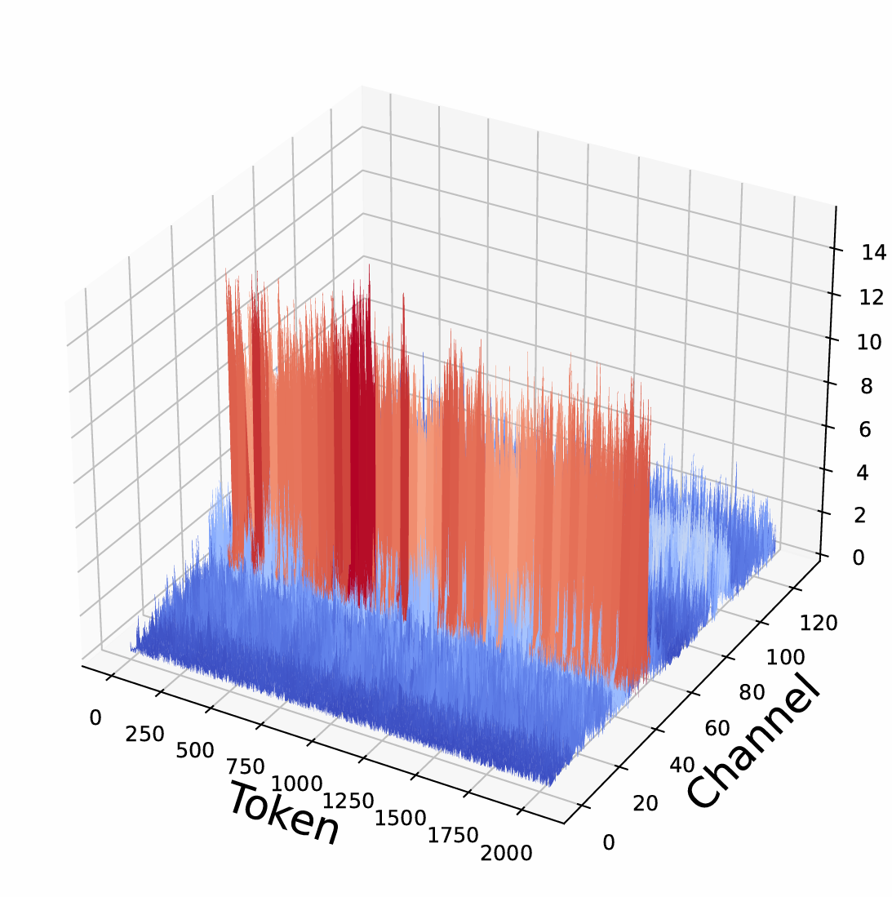
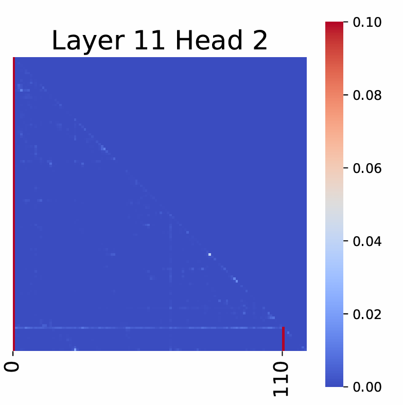

# RotateKV: Accurate and Robust 2-Bit KV Cache Quantization for LLMs via Outlier-Aware Adaptive Rotations
This repository contains the code used to reproduce the experimental results of RotateKV.


## Abstract
In this work, we explore the potential of rotation techniques for 2-bit KV quantization and propose RotateKV, which achieves accurate and robust performance with high compression ratio by incorporating several novel improvements:  
(i) Outlier-Aware Rotation, which utilizes channel-reordering to adapt the rotations to varying channel-wise outlier distributions without sacrificing the computational efficiency of the Fast Walsh-Hadamard transform (FWHT);  
(ii) Pre-RoPE Grouped-Head Rotation, which mitigates the impact of rotary position embedding (RoPE) on rotation and further smooths outliers across heads;  
(iii) Attention-Sink-Aware Quantization, which leverages the massive activations to efficiently protect attention sinks.  
RotateKV achieves less than 0.3 perplexity (PPL) degradation with 2-bit quantization on WikiText-2 using LLaMA-2-13B, maintains strong CoT reasoning and long-context capabilities, with less than 1.7\% degradation on GSM8K, outperforming existing methods even at lower average bit-widths.


## Installation
```bash
conda create -n RotateKV python==3.10 -y
conda activate RotateKV

# CUDA 11.8
conda install pytorch==2.1.2 torchvision==0.16.2 torchaudio==2.1.2 pytorch-cuda=11.8 -c pytorch -c nvidia -y

git clone https://github.com/ZunhaiSu/RotateKV.git
cd RotateKV
pip install -r requirements.txt

# Install the fast-hadamard-transform
git clone https://github.com/Dao-AILab/fast-hadamard-transform.git
cd fast-hadamard-transform
pip install -e.
```
## Usage

### Calibration for the reordering indices

### PPL Evaluation

### GSM8K Evaluation

### LongBench Evaluation

### MileBench Evaluation

### Needle-in-a-Haystack Evaluation

## Visualization

### 2D Visualizations of key_states
```bash
# generate the key_states
# pre_RoPE
python PPL_evaluation.py --save_k_pre_rope True
# post_RoPE
python PPL_evaluation.py --save_k_post_rope True
```
Next, use `RotateKV/visualize/2D Visualizations of Key Tensors.ipynb` to generate the following figure.  

### 3D Visualizations of Key Tensors
```bash
# generate the key_states
# pre_RoPE
python PPL_evaluation.py --save_k_pre_rope True
# post_RoPE
python PPL_evaluation.py --save_k_post_rope True

```
Next, use `RotateKV/visualize/3D Visualizations of Key Tensors.ipynb` to generate the following figure.  
          
### Massive Activations
```bash
# generate the massive activations
python PPL_evaluation.py --save_massive_activations True
```
Next, use `RotateKV/visualize/Massive Activations.ipynb` to generate the following figure.  

### Attention Sinks
```bash
# generate the attetnion scores
python PPL_evaluation.py --save_attention_scores True

```
Next, use `RotateKV/visualize/Attention Sinks.ipynb` to generate the following figure.  

## Citation
